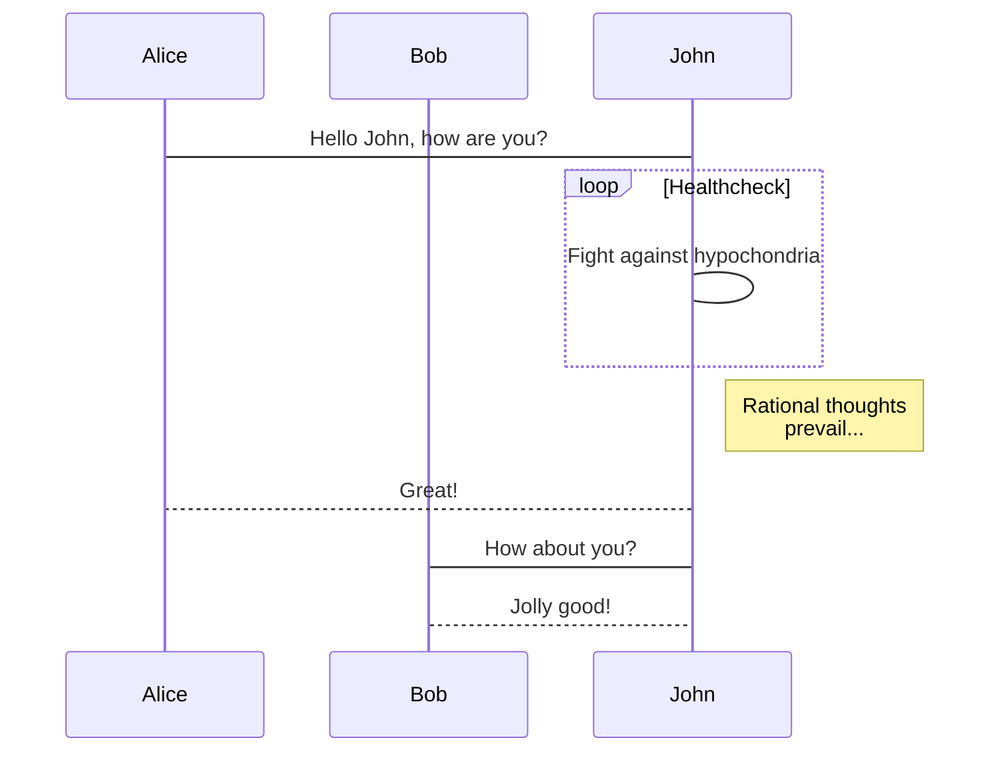
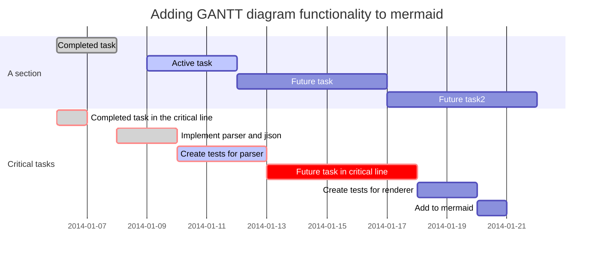

[Mermaid](https://mermaidjs.github.io/) 是一种简单的类似markdown的脚本语言，可以通过使用javascript从文本中生成图表和流程图。

<!--more-->

你需要在 *_config.yml* 或 YAML 头信息中设置相关的属性为 `true` 来开启对应的功能。
{:.warning}

[Mermaid](https://mermaid.js.org) 支持以下三种示意图:

- [Flowchart](https://mermaid.js.org/syntax/flowchart.html)

- [Sequence Diagram](https://mermaid.js.org/syntax/sequenceDiagram.html)

- [Gant Diagram](https://mermaid.js.org/syntax/gantt.html)

## 流程图 Flowchart


**markdown:**

    ```mermaid
    graph TD;
        A-->B;
        A-->C;
        B-->D;
        C-->D;
    ```

## 时序图 Sequence Diagram



**markdown:**

    ```mermaid
    sequenceDiagram
        participant Alice
        participant Bob
        Alice->John: Hello John, how are you?
        loop Healthcheck
            John->John: Fight against hypochondria
        end
        Note right of John: Rational thoughts <br/>prevail...
        John-->Alice: Great!
        John->Bob: How about you?
        Bob-->John: Jolly good!
    ```

## 甘特图 Gant Diagrams



**markdown:**

    ```mermaid
    gantt
        dateFormat  YYYY-MM-DD
        title Adding GANTT diagram functionality to mermaid
        section A section
        Completed task            :done,    des1, 2014-01-06,2014-01-08
        Active task               :active,  des2, 2014-01-09, 3d
        Future task               :         des3, after des2, 5d
        Future task2              :         des4, after des3, 5d
        section Critical tasks
        Completed task in the critical line :crit, done, 2014-01-06,24h
        Implement parser and jison          :crit, done, after des1, 2d
        Create tests for parser             :crit, active, 3d
        Future task in critical line        :crit, 5d
        Create tests for renderer           :2d
        Add to mermaid
    ```
