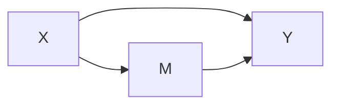
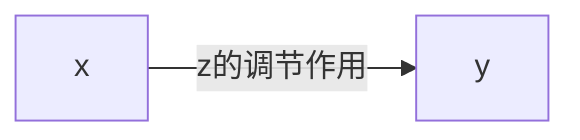

基于老龄化的现状和信息技术的发展，探究健康信息呈现方本研究探讨了大学生睡眠拖延与日间嗜睡的关系，以及失眠在其中的中介作用和睡眠时型在其中的调节作用。
采用睡眠拖延量表、失眠严重程度指数量表、Epworth 嗜睡量表和睡眠时型量表对 4252 名大学生进行调查。

<!--more-->

## 背景信息
**作者** 朱莹莹，黄佳豪，唐卓仪，刘佳莹，李欣（教育部人文社会科学重点研究基地天津师范大学心理与行为研究院）

**期刊** 心理与行为研究 2022，20(6)：797~804

**DOI**  10.12139/j.1672-0628.2022.06.012

## 主体内容

### 目的
该研究旨在以大学生为研究对象，结合以往研究，构建一个有调节的中介模型来探讨睡眠拖延对大学生日间嗜睡的影响，以及失眠的中介和睡眠时型的调节作用机制。

### 理论推导
+ 目前我国大学生群体普遍存在不同程度的**睡眠拖延问题**并带来了诸多不利影响。其中，**日间嗜睡**的问题
很有可能就是由睡眠拖延问题所导致。

+ 同时，也有研究表明睡眠拖延与失眠的关系也颇为密切，可能在大学生睡眠拖延与日间嗜睡之间起中介作用。而不同的睡眠时型
也可能会对个体日间嗜睡的机制有影响，是一个值得考察的变量。

**睡眠拖延问题**主要指个体在没有外部原因阻碍的情况下，习惯性地推迟其预定就寝时间的行为。
{:.info}

**日间嗜睡**是指个体在日间觉醒期间无法保持清醒状态，且无意识地在不恰当的时间睡着，其本质是难以维持白天所需的觉醒水平
{:.info}

基于以上的理论推导得到了以下三种假设：

1. 睡眠拖延可以正向预测我国大学生的日间嗜睡水平。

2. 失眠在大学生睡眠拖延与日间嗜睡之间起中介作用。

3. 相对于清晨型大学生，睡眠拖延对夜晚型大学生的失眠症状影响更为明显。

### 方法
**研究设计** 
采用方便取样的方法，抽取天津与河南两地高校的在校大学生进行施测。

**自变量** 睡眠拖延

**因变量** 日间嗜睡水平

**中介变量** 失眠

**调节变量** 睡眠时型

**研究工具** 

1. 睡眠拖延量表（由马晓涵等人修订，分数越高表明个体的睡眠拖延行为越严重。）

2. 失眠严重程度指数量表（由李恩泽等人修订，分数越
高表明失眠程度越严重。）

3. Epworth 嗜睡量表（由彭莉莉等人翻译修订，得分越高表明日
间嗜睡程度越严重。）

4. 睡眠时型量表（由张斌等人修订，得分越高表明个体
越倾向于清晨型，反之则倾向于夜晚型。）

### 数据分析
首先，采用 SPSS19.0对数据进行描述性统计、相关分析及差异检验。接着，通过 Hayes（2013）编制的PROCESS宏程序进行中介效应以及有调节的中介模型检验。采用偏差校正的Bootstrap法进行参数估计，并报告95%置信区间。

在bootstrap进行参数估计的过程中，只要所得的区间不包含0就可以认为具有中介效应。
{:.info}

### 结果
+ **共同方法偏差检验** 由于所有变量均采用自我报告的问卷法测量，因此可能存在共同方法偏差。通过Harman单因素检验法进行分析，结果表明本研究不存在严重的共同方法偏差。

+ **描述统计和相关分析** 睡眠拖延与日间嗜睡和失眠均呈显著正相关，与睡眠时型呈显著负相关；睡眠时型与失眠、日间嗜睡呈显著负相关；日间嗜睡与失眠呈显著正相关。

+ **协方差分析** 对不同睡眠时型大学生在睡眠拖延、日间嗜睡和失眠方面存在显著差异。

+ **中介效应分析** 采用偏差校正 Bootstrap 的方法来确定中介效应的显著性。结果表明，失眠的中介效应显著，占总效应的64%。

+ **调节效应分析** 如下图所示，可以看出睡眠时型在睡眠拖延与失眠之间的调节作用。

### 结论&讨论

1. 睡眠拖延对大学生日间嗜睡具有直接预测作用，睡眠拖延行为越严重，日间嗜睡水平越高。

2. 失眠在睡眠拖延与日间嗜睡之间起中介作用。

3. 睡眠拖延对失眠的影响受到睡眠时型的调节，相对于清晨型大学生，睡眠拖延对夜晚型大学生失眠的影响更为明显。

### 评价

1. 该研究以当下热议的睡眠为主题，探讨睡眠拖延对大学生日间嗜睡的影响和内在机制，具有较强的实践意义和现实意义。

2. 研究采用横断研究设计，无法进一步推断变量之间的因果关系。

3. 该研究采用的是问卷调查法，无法获得自变量与因变量之间因果关系。

4. 该研究所选取的样本只是大学生群体且采用的是简单抽样，样本代表性不足。

5. 研究中指出了未来大学生睡眠问题可以研究的方向，为后来的研究者提供了继续研究的可能性。

## 知识积累

### 共同方法偏差
共同方法偏差是指由于数据来源或评分者一样，或测量环境相同以及项目语境、项目本身特征所造成的预测变量与校标变量之间人为的共变。可以用Harman单因素检验法进行分析。

### 中介与调节效应
+ **中介效应**

若自变量X通过某一变量M对因变量Y产生一定的影响，则称M为X和Y的中介变量。自变量x通过中介变量m对因变量产生影响的现象被称为中介效应。

中介效应可被分为完全中介和部分中介。完全中介中自变量x只能通过中介变量m对因变量y产生影响；部分中介效应中除了通过中介变量m，自变量x还能直接对因变量y产生影响。

$$Y = cX + e_1 \notag$$

$$M = aX + e_2$$

$$Y = c'X + bM + e_3 \notag$$

+ **调节效应**

如果因变量y和自变量x的关系随第三个变量z的变化而变化，则称z在x和y之前起调节作用，此时称z为调节变量。

$$Y = f(X , M) + e$$

+ **两者的区别**

中介效应指自变量x通过中介变量m才会对因变量y产生影响，而调节效应则指调节变量z的大小会对自变量x和因变量y的关系产生影响。

---