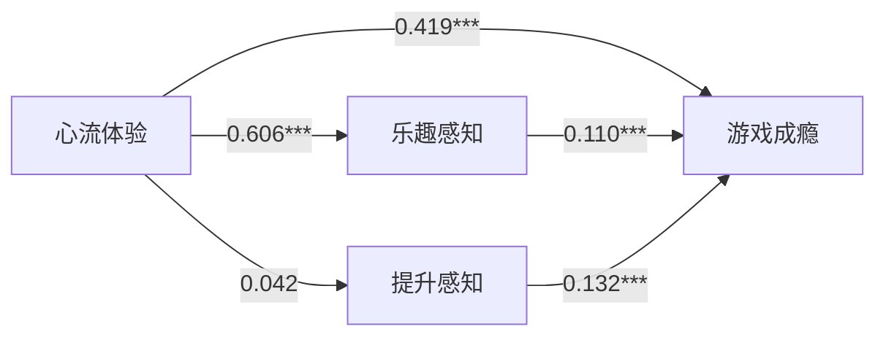

以网络游戏心流体验为解释变量，价值感知为中介变量，网络游戏
成瘾为因变量，采用实证方法分析网络游戏心流体验对游戏成瘾的直接效应和
间接效应。结果表明，网络游戏心流体验对游戏成瘾有显著的正向影响，同时，价值感知在心流体验与游戏成瘾
之间起到了部分中介作用。

<!--more-->

## 背景信息
**作者** 黄少华 朱丹红

**期刊** 中国青年社会科学 2021 年第 1 期

**DOI**  10.16034/j.cnki.10-1318/c.2021.01.015

## 主体内容

### 目的
基于前人对于网络成瘾和心流体验的研究，该研究想要去探究以下两个方面的问题，并尝试从网
络游戏意识角度，提供一个解释心流体验影响游戏成瘾机制的新视角。

1. 为什么作为积极情感体验的心流体验，会引发游戏成瘾这一消极现象?

2. 为什么同样有网络游戏心流体验的青少年玩家，有些会游戏成瘾，有些却不会?

### 理论推导

+ **网络成瘾** 在DSM-5中，网络成瘾已成为第二种被正式命名的行为成瘾，对青少年的不良影响也日益显著。所以，去探究哪些机制会影响青少年个体的网络成瘾是非常有必要的。

+ **心流体验** 现在已经有学者注意到网络游戏中的心流体验和网络成瘾有显著的相关关系，但也有学者对此提出质疑，认为结果恰恰相反。因此，想要心流体验当作解释青少年网
络游戏成瘾的一个有效视角，还需要对心流体验影响游戏成瘾的具体机制做更深入的研究。

+ **价值感知** 该研究认为，在网络空间中，客观结构性因素对网络行为的制约作用在相当程度上被弱化了，而网络意识和网络价值观念的影响作用，则被前所未有地凸显了出来。所以，包括感知有用在内的价值感知，是网络意识的一个重要维度，会影响行动者的网络行为(包括网络成瘾行为)。

### 方法
+ **研究方法** 该研究采用问卷调查法和多阶段抽样方法，对武汉、西安和宁波三城市的青少年进行数据收集

+ **研究假设** 根据之前的理论推导提出了以下三个假设：

	1. 网络游戏心流体验与游戏成瘾存在正相关关系。

	2. 网络游戏价值感知与游戏成瘾之间存在正向相关。

	3. 网络游戏心流体验不仅直接正向影响游戏成瘾，而且通过价值感知间接正向影响
	游戏成瘾，网络游戏价值感知在心流体验与游戏成瘾之间起中介作用。

+ **变量**

自变量：心流体验（从专注、愉悦感、控制感、时间扭曲、高峰体验等维度进行测量）

心流体验( Flow Experience)是
Csikszentmihalyi 提出来的一个重要概念，是指人们全神贯注地投入到一个活动时所感觉到的极
度愉悦的爽体验。当人们处于心流状态时，会专注于任务，心无旁骛，完全忽略掉其他与任务不
相关的知觉，无视周围环境，感觉时间过得飞快。一旦产生了这种心流体验，即使没有外部激励
或者物质奖励，行动者也非常乐于重复行为以维持这种愉悦体验。
{:.info}

因变量：青少年网络游戏成瘾（参照行为成瘾的测量指标，编制了8个指标的测量量表，将其作为青少年网络游戏成瘾的测量工具。）

中介变量：价值感知（该研究研究从工具性价值和情感性价值两个层面，对网络游戏价值感知进行测量。）

价值是人们与能满足其某种需要的客体属性之间的关系，而价值感知则是对客体属性能满足人们的某种目的和需求的判断与评价。
{:.info}

### 数据分析

1. 采用探索性因素分析法对网络成瘾量表，心流体验量表以及价值感知量表进行简化，并计算出各个量表的Cronbach‘s α 系数。结果表明，三个量表都具有较高的信度。

2. 采用回归分析来对各个变量进行分析，结果如下：

### 结果
由上图的回归分析表可得:

1. 模型1中，网络游戏心流体验对游戏成瘾有显著的正向影响。

2. 模型2中，网络游戏心流体验，性别，游戏时长以及游戏频率均对游戏成瘾有显著的正向影响。

3. 模型3中，价值感知的2 个因子（乐趣感知&提升感知）均对游戏成瘾有显著的正向影响。同时网络
游戏价值感知部分中介了心流体验与网络游戏成瘾的关系

4. 模型4中，价值感知的2 个因子（乐趣感知&提升感知）,性别，游戏时长以及游戏频率均对游戏成瘾有显著的正向影响。

### 结论&讨论

1. 该研究发现大约有6.1%的青少年玩家是网络游戏成瘾者。因此，相关部门和机构必须充分重视青少年的网络游戏成瘾问题。

2. 心流体验对游戏成瘾有显著的正向影响，这与在此议题上已有的很多研究发现一致。

3. 网络游戏心流体验和乐趣体验程度高的玩家，更倾向于对网络游戏
作正面和积极的评价，更倾向于通过玩网络游戏获得成就感和满足感，因而也更容易忽略网络
游戏的风险和消极面，更容易引发网络游戏成瘾。

### 评价

1. 学界很少有从青少年玩家的网络游戏意识角度对网络游戏成瘾进行探讨的学术成果，所以该研究具有一定的创新性和实践意义。

2. 心流体验只解释了游戏成瘾24.0%的变异，网络游戏价值感知也只起部分中介作用。这意味着，还存在其他影响青少年网络游戏成瘾的重要变量和机制。
为以后的研究提供了研究的可能性。

3. 研究发现说明，从网络游戏意识角度分析和解释网络游戏成瘾，是一种较
为恰当和有效的路径; 同时也意味着加强青少年的网络游戏素养教育，引导青少年玩家养成恰
当的网络游戏意识，切实提升青少年对网络游戏的辨识能力，是预防和减少游戏成瘾的重要路
径之一。

## 知识积累

### 探索性因子分析法

+ 探索性因子分析法（Exploratory Factor Analysis，EFA）是一项用来找出多元观测变量的本质结构、并进行处理降维的技术。因而，EFA能够将具有错综复杂关系的变量综合为少数几个核心因子。

+ **探索性因子分析和验证性因子分析的差异之处** 探索性因子分析有助于建立新的假设、发展新的理论；验证性因子分析适用于理论架构已经较为清晰和完善的时候。

### OLS 回归模型

+ OLS 回归模型指的是普通最小二乘回归，也称为线性回归的基础模型。它的思路就是求一些使得实际值和模型估值之差的平方和达到最小的值，
将其作为参数估计值，通过最小化误差的平方和寻找数据的最佳函数匹配。

+ 为了能够恰当地解释OLS模型的系数，数据必须满足以下统计假设：

	（1）正态性。对于固定的自变量值，因变量值成正态分布

	（2）独立性。Yi值之间相互独立。

	（3）线性。因变量与自变量之间为线性相关。

	（4）同方差性。因变量的方差不随自变量的水平不同而变化。

---